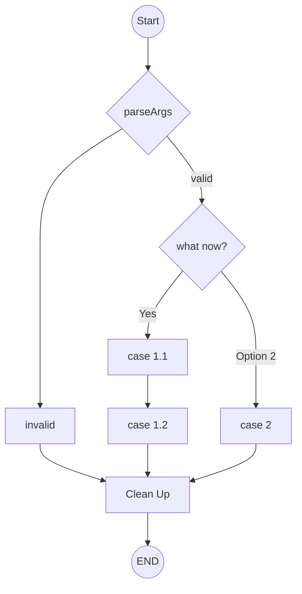

# Flow-charts in Markdown

Here is a simple flow-chart using [Mermaid.js](https://mermaid-js.github.io/mermaid/#/).

```mermaid
flowchart TD;
  A((Start))-->B{parseArgs};
  B -- valid --> C{what now?}
  B --> invalid --> Z[Clean Up]
  C-- Yes -->D[case 1.1];
  C-- Option 2 -->E[case 2]
  D --> G[case 1.2]
  G --> Z
  E --> Z
  Z --> A2((END))
```
