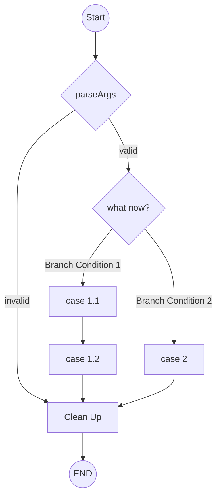
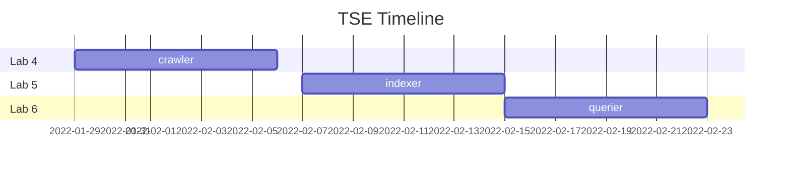
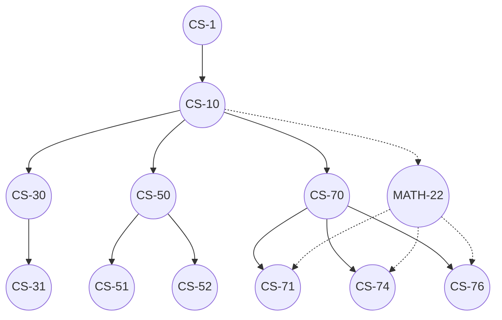

# Diagrams in Markdown

[Mermaid.js](https://mermaid-js.github.io/mermaid/#/)
is a javascript framework that detects Markdown code-blocks annoted with "`mermaid`"
and renders them as flow-charts, graphs, gantt charts, or other diagrams.

## Flowcharts

Here is a simple mermaid code-block...

<!-- This is not rendered (no mermaid tag). -->

```text
  ```mermaid
    flowchart TD;
      A((Start)) --> B{parseArgs}
      B -- valid --> C{what now?}
      B -- invalid --> Z[Clean Up]
      C -- Branch Condition 1 --> D[case 1.1]
      C -- Branch Condition 2 -->  E[case 2]
      D --> G[case 1.2]
      G --> Z
      E --> Z
      Z --> A2((END))
  \```
```

...which gets rendered as this flow-chart:

<!-- This is rendered (has mermaid tag). -->


## Gantt Charts

Code block:

<!-- No mermaid tag, not rendered! -->
```text
  ```mermaid
    gantt
      title TSE Timeline
      dateFormat  YYYY-MM-DD
      section Lab 4
        crawler      :2022-01-29, 8d
      section Lab 5
        indexer      :2022-02-07, 8d
      section Lab 6
        querier      :2022-02-15, 8d
  \```
```

Render as:

<!-- Indentical to above, but has mermaid tag so it is rendered. -->


## Graphs

Here's a dependency graph of popular CS classes at a random school in the US.

<!-- Not rendered -->
```text
  ```mermaid
    graph TD
      A((CS-1))
      B((CS-10))
      C((CS-30))
      D((CS-50))
      E((CS-70))
      F((CS-31))
      G((CS-51))
      H((CS-52))
      I((CS-71))
      J((CS-74))
      K((CS-76))
      L((MATH-22))

      A --> B
      B --> C
      B --> D
      B --> E
      C --> F
      D --> G
      D --> H
      E --> I
      E --> J
      E --> K
      L -.-> I
      L -.-> J
      L -.-> K
      B -.-> L
  \```
```

<!-- Rendered -->



That's it!

If you use [vscode](https://code.visualstudio.com/), you can need the [Mermaid extension](https://marketplace.visualstudio.com/items?itemName=bierner.markdown-mermaid) to render in your local editor.
GitHub supports Mermaid natively, so once your push your code to GitHub the diagrams will be visible.
